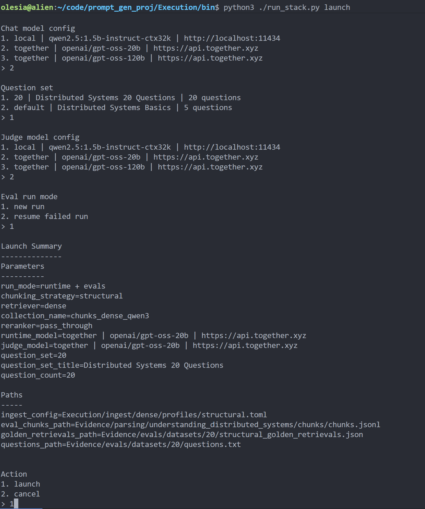

# Architecture Overview

## System shape

The repository is organized around three connected parts of the system:

1. **Knowledge preparation**
   Source documents are parsed, chunked, and ingested into retrieval-ready storage.

2. **Online RAG runtime**
   A user query goes through retrieval, reranking, and generation to produce an answer.

3. **Offline analysis**
   Request-level evidence is captured and later reused for evaluation, reporting, and diagnostic review.

This split keeps data preparation, online execution, and offline analysis separate enough to be inspected and evolved independently.

---

## High-level diagram

---

## Main flow

### 1. Knowledge preparation

The preparation side of the system is a staged data pipeline rather than a single preprocessing step.

It is split into three responsibilities:

- **extractor** — converts source PDFs into validated page-level JSONL records;
- **chunker** — transforms validated page data into validated chunk-level JSONL records;
- **ingest** — turns chunk records into retrieval-ready storage.

The project currently supports two chunking modes:

- **structural chunking**, which builds chunks from prepared page `clean_text` and validated content metadata;
- **fixed chunking**, which uses token-based chunk sizing with sentence-preserving boundaries. The current fixed baseline is 350 tokens with 15% overlap.

Chunk sizing is tokenizer-based rather than character-based.

Ingest is separated from chunking. The project supports:

- **dense ingest**
- **hybrid ingest**, with two sparse retrieval strategies: **bag-of-words** and **BM25-like**

The current ingest path does not implement collection reindexing. Instead, it uses idempotency and fingerprint checks to detect embedding-relevant changes. When fingerprint fields change, the current behavior is to log and skip rather than silently rebuild points.
Embeddings are generated from chunk text through a local embedding service; the current baseline model is `qwen3-embedding:0.6b`.

#### Validation and contracts

Knowledge preparation is heavily contract-driven.

Page-level and chunk-level artifacts are treated as schema-bound data products. The specs and tests explicitly validate JSONL structure, schema conformance, sanitation, and variant-specific behavior. That means the preparation layer is not only responsible for producing data, but also for preserving stable contracts between extraction, chunking, ingest, and later evaluation.

---

### 2. Online runtime

The online runtime is implemented as a staged pipeline owned by the `rag_runtime` crate.

Its main stages are:

- **input validation**
- **retrieval**
- **reranking**
- **generation**
- **request capture persistence**

`orchestration` owns pipeline sequencing. Each stage receives explicit typed inputs and returns explicit typed outputs rather than reading hidden shared state. The runtime therefore behaves as a contract-driven pipeline, not as a loosely coupled sequence of ad hoc calls.

A simplified flow is:

`UserRequest -> ValidatedUserRequest -> RetrievalOutput -> RerankedRetrievalOutput -> GenerationRequest -> GenerationResponse -> UserResponse`

### Runtime variation through configuration

Runtime component variants are interchangeable and selected through typed settings.

- retrieval runs as **dense** or **hybrid** according to `Settings.retrieval`
- reranking implementation is selected by `Settings.reranking.reranker`

This keeps the pipeline shape stable while allowing different retrieval and reranking strategies to be compared under the same orchestration and evaluation flow.

### Retrieval and reranking as evaluated stages

During evaluated batch execution, orchestration loads the golden retrieval companion file, resolves per-question `GoldenRetrievalTargets`, and passes them into retrieval and reranking.

That allows both stages to compute request-local retrieval-quality metrics during runtime without increasing latency.

The runtime retrieval-quality bundle includes:

- `recall_soft`
- `recall_strict`
- `rr_soft`
- `rr_strict`
- `ndcg`
- `first_relevant_rank_soft`
- `first_relevant_rank_strict`
- `num_relevant_soft`
- `num_relevant_strict`

In addition to being propagated into `RequestCapture`, these request-level retrieval metrics are also exposed as attributes on the root request span.

### Stage ownership

The runtime keeps stage responsibilities separate:

- **input validation** normalizes and validates input before retrieval
- **retrieval** performs embedding, search, and payload mapping
- **reranking** reorders already retrieved candidates
- **generation** builds the final prompt and produces the answer
- **request capture persistence** stores completed request evidence after successful execution

Reranking returns the full reranked candidate set without truncation. Final truncation for generation remains orchestration-owned. Even the `pass_through` variant is represented as an explicit reranking stage rather than as a pipeline bypass.

This keeps runtime behavior structurally comparable across pipeline variants.

### Runtime configuration model

The runtime does not operate only on request-time settings.

Its retrieval stage also receives typed ingest-derived configuration so that query-time retrieval uses the same retrieval-relevant fields that were used during ingest. In practice, `RetrievalSettings` combines runtime-owned retrieval parameters with an `ingest` section loaded from the ingest config.

This keeps retrieval aligned with the indexed data model rather than re-declaring collection, vector, embedding, and sparse-strategy details independently inside the runtime.

For dense retrieval, this includes fields such as embedding model name, embedding dimension, collection name, vector name, and corpus version.

For hybrid retrieval, this also includes dense and sparse vector names, tokenizer and preprocessing settings, vocabulary / term-stat artifacts, and the selected sparse retrieval strategy.

### Runtime observability as a contract surface

Runtime observability is specified through separate metric and span contracts rather than being defined only inside implementation code.

The repository keeps metric definitions, span hierarchy, and Grafana dashboard contracts in dedicated specifications. These specs are used as generation inputs for both runtime telemetry code and Grafana provisioning/dashboard artifacts.

This reduces the risk of drift between:

- what the runtime emits,
- what dashboards expect,
- and how request behavior is interpreted operationally.

In architectural terms, observability is treated as a first-class contract surface of the runtime rather than as an implementation afterthought.

---

### 3. Offline analysis

Offline analysis is implemented as a separate staged pipeline rather than as a post-processing helper around the live request path.

Its responsibility is to turn persisted request evidence into stable evaluation runs, normalized judge outputs, request-level summaries, and run-level reports.

#### Eval orchestration

The offline pipeline is owned by `eval_orchestrator`.

It is responsible for:

- creating or resuming a `run_id`,
- creating and updating `run_manifest.json`,
- bootstrapping eligible requests from `request_captures` into `eval_processing_state`,
- invoking worker stages in pipeline order,
- promoting completed requests into the next stage,
- detecting terminal run completion,
- and building the final `run_report.md`.

This keeps run coordination separate from stage-local judging logic.

#### Frozen run scope

A central design choice in the eval architecture is the use of a frozen run scope.

For a new run, the orchestrator selects only those request captures whose `request_id` is not already present in `eval_processing_state`. The resulting `run_scope_request_ids` are written into `run_manifest.json` and treated as immutable for the life of the run.

When a failed run is resumed, the orchestrator must reuse the same `run_id`, reload the same manifest, and continue from the stored run scope without adding newly captured requests.

This makes comparisons and reruns more stable than an analysis flow that continuously absorbs new data.

#### Stage pipeline

The current offline analysis pipeline has three stages:

1. **judge_generation**
2. **judge_retrieval**
3. **build_request_summary**

The orchestrator owns stage ordering and promotion.

- completed `judge_generation` work is promoted to `judge_retrieval`
- completed `judge_retrieval` work is promoted to `build_request_summary`

This means the offline path is not a single evaluation pass, but a multi-stage stateful workflow.

#### Stage responsibilities

- **judge_generation** evaluates generation quality for one eligible request and writes normalized generation-judge rows into `judge_generation_results`
- **judge_retrieval** expands one eligible request into chunk-level retrieval evaluation units and writes normalized retrieval-judge rows into `judge_retrieval_results`
- **build_request_summary** derives one request-level summary row from completed upstream results and writes it into `request_summaries`

Both judge stages also record factual judge-call usage rows in `judge_llm_calls`.

The summary stage additionally copies reranking metadata from `request_captures` so downstream analysis can compare reranker usage without re-reading the raw capture table.

#### Eval storage model

The offline pipeline depends on a PostgreSQL eval schema that already exists before orchestration begins.

The main state surfaces are:

- `request_captures`
- `eval_processing_state`
- `judge_generation_results`
- `judge_retrieval_results`
- `request_summaries`

This storage-backed design makes offline analysis resumable, stage-aware, and inspectable across the lifecycle of a run.

#### Observability of eval runs

Offline analysis has its own observability contract.

- `eval_orchestrator` owns the root `eval.run` span
- each worker module owns only its own request-level and nested work spans
- long-running judge work is made visible through per-request, per-suite, and per-chunk spans

This keeps evaluation behavior inspectable in the same spirit as the online runtime, while preserving clear ownership between orchestration and worker stages.

#### Outputs of offline analysis

The offline pipeline produces two kinds of outputs:

- **human-readable run artifacts**, such as `run_report.md`
- **dashboard-ready tabular outputs**, which act as data sources for Grafana eval dashboards

This allows the same eval run to be reviewed in two complementary ways:

- as a narrative report for per-run interpretation
- as structured run-scoped data for dashboard comparisons, run listings, and aggregate analysis across runs

---

## Request capture as the key bridge

The main bridge between online execution and offline analysis is **RequestCapture**.

In this repository, request capture is not an ad hoc log record. It is a contract-bound domain artifact assembled by `orchestration` after a successful completed request and then persisted through a dedicated `request_capture_store` boundary.

This separation matters:

- **orchestration** owns assembly of the request-level capture
- **request_capture_store** owns validation, storage mapping, and database persistence
- downstream eval pipelines consume persisted captures from `request_captures`

`RequestCapture` is also schema-bound. Before write, it is validated against its machine-readable schema and checked against storage-compatibility invariants. This makes request capture part of the system’s explicit data model rather than an informal byproduct of execution.

Architecturally, request capture separates two concerns:

- **serving a request now**
- **preserving a stable, reusable representation of what happened during that request**

That preserved representation includes not only the final answer, but also retrieval results, retrieval-stage metrics, reranking-stage metrics, token accounting, and reranker-related metadata. Because of that, offline analysis can start from captured request evidence rather than reconstructing system behavior later from logs alone.

Request capture is therefore both a persistence boundary and a data-contract boundary between runtime execution and offline evaluation.

---

## Retrieval index and knowledge store

The retrieval index / knowledge store is the main meeting point between knowledge preparation and online retrieval.

It is not treated as a generic vector dump. It is a retrieval-facing data surface whose structure is defined upstream by ingest and consumed downstream by retrieval under explicit compatibility rules.

### What lives here

Knowledge preparation produces retrieval-ready storage in Qdrant.

Depending on the ingest mode, that storage may contain:

- a dense vector space for dense retrieval,
- dense + sparse vector spaces for hybrid retrieval,
- chunk payloads that are rich enough to reconstruct canonical chunk records at retrieval time,
- collection-level metadata that describes retrieval-relevant properties of the indexed corpus.

For hybrid retrieval, the indexed representation also depends on the selected sparse retrieval strategy, currently **bag-of-words** or **BM25-like**.

### Why this layer matters architecturally

This layer is where ingest-time decisions become runtime behavior.

Changes in chunking, embedding configuration, sparse strategy, or collection layout propagate through the index into:

- candidate selection,
- retrieval metrics,
- reranking inputs,
- and final answer generation.

Because of that, the index is not just a storage concern. It is part of the retrieval contract of the system.

### Contract between ingest and retrieval

Runtime retrieval does not re-declare its own independent view of the index.

Instead, retrieval receives ingest-derived typed settings so that query-time behavior stays aligned with the indexed data model. That includes collection names, vector names, embedding settings, and, for hybrid retrieval, sparse-side configuration such as tokenizer / preprocessing choices and sparse strategy.

This reduces configuration drift between how data was indexed and how it is later queried.

### Payload and metadata expectations

Retrieved points are expected to carry payloads that can be mapped into canonical chunk records.

That means the knowledge store is responsible not only for approximate nearest-neighbor search, but also for preserving enough structured payload data for downstream runtime use. In dense retrieval, collection metadata also exposes `chunking_strategy`, which is fetched once, cached in the retriever, and surfaced as collection-level metadata in retrieval output.

### Current constraints

The current ingest path does not yet implement collection reindexing / rebuild as a first-class workflow.

Instead, ingest uses fingerprint-based safeguards to detect embedding-relevant changes. This protects against silent drift, but it also means that full index rebuild remains an explicit future extension rather than a completed capability.

---

## Language split

The repository uses two implementation environments for different roles:

- **Python** for parsing, chunking, and ingest workflows;
- **Rust** for runtime structure, orchestration, and stricter system boundaries.

This is a division of responsibility, not a technology showcase. The split reflects the different needs of document-processing workflows and runtime pipeline control.

---

## Repository model

At repository level, the architecture is not only code.

The project is structured around several engineering surfaces:

- **execution** — runnable pipeline logic and supporting services;
- **specification** — contracts, schemas, and explicit definitions;
- **measurement** — metrics, dashboards, and evaluation surfaces;
- **evidence** — captured requests, run artifacts, manifests, and reports;
- **documentation** — narrative explanation of the system and its design.

This broader repository model matters because the project is meant to support analysis and comparison, not only execution.

---

## What this architecture is optimized for

The current architecture is optimized for:

- controlled local experimentation,
- comparison of pipeline variants,
- request-level inspection,
- offline evaluation,
- observability-driven diagnosis.

It is not optimized for:

- production-scale serving,
- tenant isolation,
- deployment orchestration as a primary concern,
- end-user application UX.

Those are different architectural goals from the ones this repository is pursuing.

---

## Models and external services

The project is designed around interchangeable model and service backends rather than a single fixed execution path.

The matrix below shows the main model-dependent and service-dependent capabilities exposed by the current repository configuration.

### Capability matrix

| Area | Capability / variants | Local | External API |
|---|---|---:|---:|
| **Embedding for ingest** | `qwen3-embedding:0.6b` | Yes | No |
| **Embedding input** | `chunk.text` | Yes | No |
| **Generation transport** | `ollama`, `openai` | Yes | Yes |
| **Generation models currently configured** | `qwen2.5:1.5b-instruct-ctx32k`, `openai/gpt-oss-20b` | Yes | Yes |
| **Reranking kinds** | `pass_through`, `heuristic`, `cross_encoder` | Yes | Yes |
| **Cross-encoder providers configured** | `mixedbread-ai`, `voyageai` | No | Yes |
| **Cross-encoder models currently configured** | `mixedbread-ai/mxbai-rerank-base-v2`, `rerank-2.5` | No | Yes |
| **Eval judge providers** | `ollama`, `together` | Yes | Yes |
| **Eval judge model currently configured** | `openai/gpt-oss-20b` | No | Yes |
| **Retrieval store** | Qdrant | Yes | No |
| **Request capture / eval state store** | PostgreSQL | Yes | No |
| **Observability stack** | Grafana, Tempo, Phoenix, OTEL-based tooling | Yes | No |

### Current retrieval and indexing baseline

For dense ingest, the current checked-in config uses:

- embedding model `qwen3-embedding:0.6b`
- embedding input `chunk.text`
- Qdrant collection `chunks_dense_qwen3`

This means the current dense retrieval baseline is built on local embeddings generated from chunk text and stored in a local vector index.

### Retrieval variability

At runtime, retrieval is configuration-driven rather than hard-coded. The checked-in `rag_runtime.toml` currently shows `retrieval.kind = "dense"`, but the runtime is designed to switch retrieval variants through typed settings.

On the indexing side, the project supports both dense and hybrid retrieval preparation. Hybrid indexing supports two sparse retrieval strategies:

- **bag-of-words**
- **BM25-like**

This keeps retrieval variation part of the architecture rather than an ad hoc extension.

### Why this matters architecturally

This variability is intentional.

The project keeps pipeline shape stable while allowing model backends and service backends to vary across:

- generation,
- reranking,
- evaluation,
- and retrieval preparation.

That makes the repository suitable for comparative experiments without requiring a different system design for each backend choice.

---

## Launcher layer

The repository includes a thin launcher layer in `Execution/bin` built around `run_stack.py` and scenario-specific shortcuts.

Its role is not only convenience. It also acts as an execution control layer for experiment setup.

The project supports many valid combinations of:

- runtime vs eval-only execution
- chunking strategy
- retriever kind
- reranker kind
- model/provider selection
- new-run vs resume-run behavior

Instead of requiring a dedicated static config file for every combination, the launcher guides the user through selecting a concrete variant and then assembles a temporary run configuration from those choices.

This keeps experiment launching manageable without turning configuration variability into a combinatorial explosion of checked-in config files.

Architecturally, the launcher sits above the runtime and eval subsystems as a composition layer: it does not redefine their contracts, but it controls how concrete execution scenarios are materialized from the supported capability space.

The launcher also supports restarting unfinished eval runs. For eval-only execution, it can switch between launching a new run and resuming a failed run, present the available resumable runs to the user, and materialize the correct restart configuration for the selected run.

---

## How to read the next layer

This document explains the system shape and the main boundaries.

For more detail on how the analysis side works:

- see [Evaluation Story](EVALUATION_STORY.md) for request capture, runs, and reports;
- see [Observability Story](OBSERVABILITY_STORY.md) for traces, metrics, and dashboards;
- see [Specification-First Approach](SPECIFICATION_FIRST_APPROACH.md) for the role of contracts and schemas in the repository.