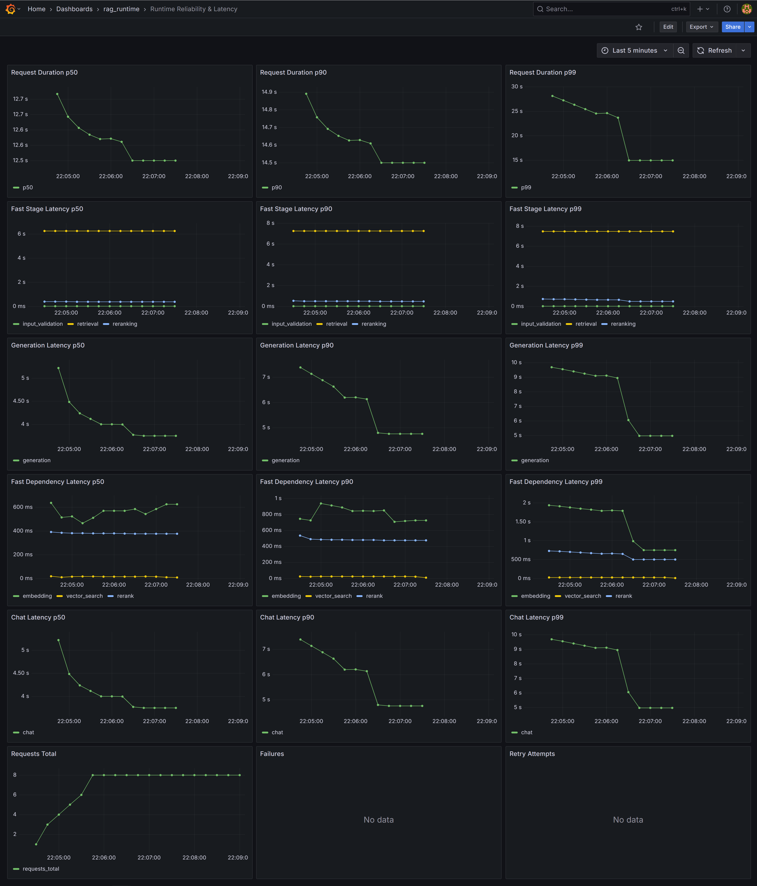

# Evaluation Story

## Why Evaluation Is A First-Class Part Of The Project

This project does not treat evaluation as a one-off notebook or a manually
assembled benchmark script.

Evaluation is built as a structured subsystem with its own:

- input contract
- workflow state
- run identity
- storage tables
- artifacts
- dashboards

That design choice makes the project much more than a runtime demo.
It turns the repository into an experimentation platform.

## The Core Idea

The key evaluation idea is simple:

- every successful runtime request becomes a canonical `RequestCapture`
- evaluation consumes those captures as stable source data
- the eval engine processes them through a resumable run-oriented pipeline
- the run produces durable machine-readable and human-readable artifacts

This means evaluation starts from the same concrete request record that the
runtime actually produced.

_The eval dashboard shows the run campaign as a first-class subsystem: token usage by scope and a run table with `run_id`, chunking, retriever, reranker, runtime model, and status._

## Why `RequestCapture` Matters

`RequestCapture` is the bridge between online behavior and offline analysis.

It includes the information needed to judge a request meaningfully:

- the original query
- the normalized query
- retriever kind and retriever config snapshot
- reranker kind and reranker config snapshot
- retrieval outputs
- reranked ordering
- generation token usage
- retrieval-stage metrics
- reranking-stage metrics

Because the eval engine reads captured requests instead of trying to reconstruct
them from traces, the project gains:

- reproducibility
- schema validation
- stable downstream contracts
- easier debugging of run-to-run differences

## Run-Oriented Evaluation

The eval engine is organized around explicit eval runs.

Each run has:

- a stable `run_id`
- a frozen request scope
- a run manifest
- a run report

The most important property here is that run scope is frozen at bootstrap time.

That means:

- a resumed run does not silently absorb newer requests
- the run remains semantically stable after a failure
- comparisons between runs stay meaningful

This is one of the strongest quality decisions in the project because it
protects experiment integrity.

## Eval Stages

The current eval engine processes each run through three sequential stages:

1. `judge_generation`
2. `judge_retrieval`
3. `build_request_summary`

These stages are intentionally separated.

Why:

- generation quality and retrieval quality are different evaluation domains
- summaries should be derived from produced results, not mixed into judge logic
- stage boundaries make resume behavior much easier to reason about

This structure keeps the eval engine closer to a workflow system than to a
single monolithic scoring script.

## Judge Outputs And Summaries

The system stores judge outputs in normalized result tables and then derives
request-level summaries from them.

This separation matters because:

- raw judge outputs remain inspectable
- derived summaries can evolve without losing original judging results
- dashboards and reports can be built from stable aggregate layers

In practice, the repository supports both:

- request-level analysis
- run-level comparison

## Run Artifacts

Each eval run produces two especially important artifacts:

- `run_manifest.json`
- `run_report.md`

`run_manifest.json` is the structured metadata record for the run.
It tells us:

- which requests were included
- what judge model was used
- what the run status is
- how the run was configured

`run_report.md` is the human-readable snapshot of the run.
It is the artifact most suitable for demos, reviews, and quick engineering
comparison.

Together, these artifacts make runs inspectable both by machines and by humans.

In practice, `run_report.md` is organized as a compact engineering review
artifact. Its most useful sections are:

- `Run Metadata`: request count, model choices, retriever/reranker settings
- `Aggregated Metrics`: answer quality, retrieval relevance, and top-level rates
- `Label Distributions`: how judges classified outputs across the run
- `Retrieval Quality`: `retrieval@12` and `generation_context@4` quality signals
- `Conditional Retrieval→Generation Aggregates`: answer quality conditioned on relevant context being present
- `Worst-Case Preview`: the weakest requests in the run
- `Token Usage`: runtime and judge token/cost summary

Latest example report:

- [Latest 20-question run report](../Evidence/evals/runs/2026-04-10T19-42-16.271737+00-00_0d85b984-5f15-4529-a4b2-9ac11f496372/run_report.md)

## Why Resume Support Is Important

Evaluation runs can fail for reasons that are unrelated to the meaning of the
experiment:

- transient provider failures
- local infrastructure issues
- rate limits
- temporary network problems

If the only recovery path were “start over from scratch,” evaluation would be
fragile and expensive.

The current design avoids that problem by letting the orchestrator resume the
same run with the same run scope.

This makes the system much more practical for real engineering iteration.

## Why This Subsystem Makes The Project Stronger

A lot of RAG projects can produce answers.
Far fewer can answer:

- which run produced this result?
- what exact request scope was judged?
- what configuration produced this output?
- how do two runs compare over the same frozen request set?

This project can answer those questions because evaluation is part of the
system architecture, not an afterthought.

## What This Enables

Because evaluation is structured this way, the project can support:

- controlled comparison of retrieval variants
- controlled comparison of reranker variants
- request-level drilldown
- run-level reporting
- resumable experiment execution
- cost and token analysis across runs
- dashboard-backed experiment review

That is one of the clearest reasons the repository already feels like a real
engineering platform rather than only a prototype application.

_The runtime dashboard complements the eval artifacts by showing stage-level and dependency-level behavior during live experiment traffic, including retrieval, reranking, generation, and underlying dependency calls._
