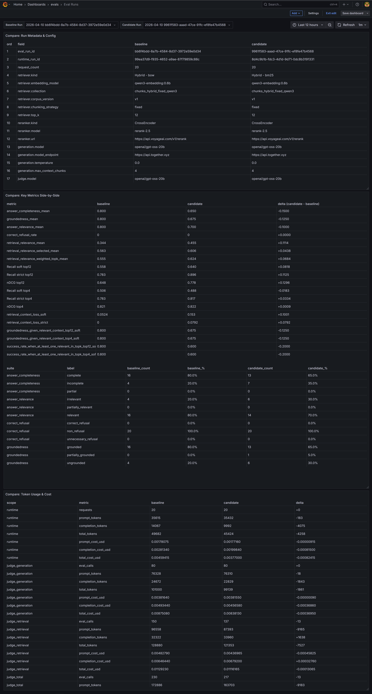
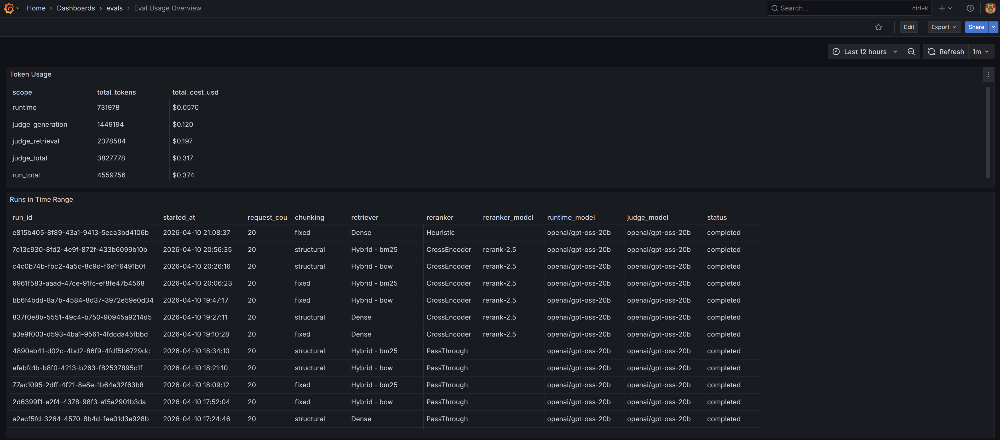

# Evaluation Story

## What this document covers

This document explains how captured request evidence becomes stable eval runs, normalized judge outputs, run reports, and Grafana-facing comparison surfaces.

It builds on `ARCHITECTURE_OVERVIEW.md` and focuses on the evaluation workflow itself: run formation, stage progression, result materialization, and output surfaces for interpretation and comparison.

For the role of fixed question sets and golden retrieval companions in controlled runtime evaluation, see `GOLDEN_DATASETS.md`.

---

## Why evaluation is a first-class workflow in this project

In this project, evaluation is implemented as a separate workflow rather than as an ad hoc pass over loosely collected outputs.

It has its own orchestrator, run identity, frozen run scope, stage-local workers, normalized result tables, and run artifacts. This makes pipeline variants easier to compare under a stable and inspectable evaluation flow.

---

## Where evaluation starts

Evaluation begins from persisted request evidence.

The online runtime stores request-level captures in `request_captures`. Those captures act as the upstream input surface for offline evaluation. An eval run does not replay the live request path. It starts from already captured request evidence.

That separation is important because it allows evaluation to continue even when the runtime evolves, and it makes run membership explicit instead of implicit.

---

## Eval run as a tracked entity

Each evaluation run is coordinated by `eval_orchestrator`.

For a new run, the orchestrator:

- creates a new `run_id`
- records run start metadata
- creates `run_manifest.json`
- discovers eligible requests from `request_captures`
- bootstraps missing rows into `eval_processing_state`

For a resumed run, the orchestrator reuses the same `run_id`, reloads the previous manifest, and continues from the persisted run state rather than starting over.

This makes an eval run a real tracked entity rather than a one-off batch script.

---

## Frozen run scope

One of the central design choices in the evaluation system is the use of a frozen run scope.

For a new run, only request captures whose `request_id` is not already present in `eval_processing_state` are admitted into the run. The resulting `run_scope_request_ids` are written into `run_manifest.json` and treated as immutable for the life of the run.

When a failed run is resumed, the orchestrator must use the same `run_id` and the same stored run scope. Newly captured requests must not be absorbed into the resumed run.

This keeps comparisons stable and prevents the run from silently changing shape while it is being evaluated.

---

## Stage pipeline

The current evaluation pipeline has three stages:

1. `judge_generation`
2. `judge_retrieval`
3. `build_request_summary`

The orchestrator owns stage ordering and promotion.

That means workers do not coordinate the full run. Each worker owns only its local stage logic, while the orchestrator controls:

- which stage is active
- when a stage is drained
- how completed requests are promoted
- when the run is considered complete

This makes the eval system stateful and explicit rather than opportunistic.

---

## What each stage evaluates and produces

### 1. judge_generation

`judge_generation` evaluates answer quality for one eligible request at a time through four LLM-judge suites.

For the current version, it runs four generation evals:

- **answer_completeness** — whether the answer fully addresses the user query
- **groundedness** — whether the answer is supported by the chunks selected for generation
- **answer_relevance** — whether the answer is relevant to the user query
- **correct_refusal** — whether a refusal, if present, is appropriate rather than unnecessary or missing

Its judge inputs are built from the captured request:

- `normalized_query`
- `final_answer`
- and, for **groundedness**, the text of all retrieval items where `selected_for_generation = true`

This stage writes:

- normalized generation-judge rows into `judge_generation_results`
- factual judge-call usage rows into `judge_llm_calls`

So this stage answers the question: **How good was the generated answer, and in what way?**

### 2. judge_retrieval

`judge_retrieval` evaluates retrieval quality for one eligible request at a time by judging retrieved chunks in ranked order.

For the current version, it runs one retrieval eval:

- **retrieval_relevance** — whether each retrieved chunk is relevant to the user query

Its judge inputs are:

- `normalized_query`
- `chunk_text`

This evaluation is performed for each retrieved chunk in rank order, using the captured `retrieval_results` as the source of the expected chunk set.

This stage writes:

- normalized chunk-level retrieval rows into `judge_retrieval_results`
- factual judge-call usage rows into `judge_llm_calls`

So this stage answers the question: **Which retrieved chunks were actually relevant, and how did relevance distribute across the ranked set?**

### 3. build_request_summary

`build_request_summary` does not call a judge model.

Instead, it waits until all required upstream eval results exist for the request, then materializes one request-level summary row.

It combines:

- request metadata from `request_captures`
- generation eval outputs from `judge_generation_results`
- retrieval eval outputs from `judge_retrieval_results`

The resulting summary includes, among other things:

- per-suite generation scores and labels for:
  - `answer_completeness`
  - `groundedness`
  - `answer_relevance`
  - `correct_refusal`
- aggregated retrieval fields such as:
  - `retrieval_chunk_count`
  - `retrieval_relevance_mean`
  - `retrieval_relevance_selected_mean`
  - `retrieval_relevance_topk_mean`
  - `retrieval_relevance_weighted_topk`
  - `retrieval_relevance_relevant_count`
  - `retrieval_relevance_selected_count`

This stage writes:

- one normalized summary row into `request_summaries`

So this stage answers the question: **What is the consolidated evaluation picture for this request?**

---

## State tables and materialized evaluation data

The evaluation pipeline depends on a PostgreSQL eval schema that exists before orchestration begins.

Its main state surfaces are:

- `request_captures`
- `eval_processing_state`
- `judge_generation_results`
- `judge_retrieval_results`
- `request_summaries`
- `judge_llm_calls`

Together, these tables make evaluation resumable, stage-aware, and queryable. Evaluation in this project is therefore materialized as structured state, not only as reports, logs, or traces.

---

## Run completion and report building

A run is complete when every request in the frozen run scope reaches:

- `current_stage = build_request_summary`
- `status = completed`

At that point, the orchestrator finalizes the manifest and builds the canonical `run_report.md`.

The report is run-scoped and built from the run manifest plus database-backed evaluation data, which gives it a stable identity and a clear relationship to the underlying evaluated run.

---

## Two output surfaces: report view and dashboard view

The evaluation system produces two complementary output surfaces:

- **report view** — a human-readable artifact for interpreting one run or a comparison set
- **dashboard view** — Grafana-backed tabular and aggregate views for browsing runs, comparing them, and inspecting usage / evaluation patterns

These two surfaces are designed for different kinds of work. Reports are better for interpretation and written conclusions. Dashboards are better for navigation, comparison, filtering, and repeated review across many runs.

### Report view

The report view is the canonical human-readable snapshot artifact for one completed eval run.

In this project, `run_report.md` complements Grafana dashboards with a fixed, run-scoped interpretation surface. It is built from the run manifest plus run-filtered evaluation tables and is intended to stay compact enough for human review rather than becoming a raw export of per-request data.

The latest visible run report in the repository is:

- **[run_report.md](../Evidence/evals/runs/2026-04-10T19-42-16.271737+00-00_0d85b984-5f15-4529-a4b2-9ac11f496372/run_report.md)**

Based on the report contract and the current checked-in run artifact, the report view in this project is organized around these sections:

#### 1. Run Metadata

This section identifies the evaluated run and records the configuration context needed to interpret it.

In the contract, this section must include run identity fields such as `run_id`, `run_type`, `status`, `started_at`, `completed_at`, `request_count`, `requests_evaluated`, and enabled suite versions, followed by subsections for **Retriever**, **Reranker**, **Generation**, and **Judge**.

In the latest run report, this section includes:

- eval run identity and timing
- request counts
- generation and retrieval suite versions
- retriever details such as kind, embedding model, collection, corpus version, chunking strategy, `top_k`, and actual returned chunk statistics
- reranker kind, model, and endpoint
- generation model, endpoint, temperature, and `max_context_chunks`
- judge provider, model, and endpoint.

This makes the metadata section the main provenance surface for understanding what exact system configuration produced the run.

#### 2. Aggregated Metrics

This is the main analytical summary section of the report.

The contract requires a compact aggregated metrics table covering generation-quality and retrieval-quality signals such as:

- `answer_completeness_mean`
- `groundedness_mean`
- `answer_relevance_mean`
- `correct_refusal_rate`
- `retrieval_relevance_mean`
- `retrieval_relevance_selected_mean`
- `retrieval_relevance_weighted_topk_mean`

with mean / percentile / contributing-count formatting rules depending on metric type.

In the latest run report, this section appears as a compact metric table with mean-or-rate, p50, p90, and count columns.

This section is the fastest way to understand the overall quality shape of a single run before looking at more diagnostic breakdowns.

#### 3. Label Distributions

This section summarizes categorical outcomes for the current run.

The contract requires breakdowns for:

- `answer_completeness`
- `groundedness`
- `answer_relevance`
- `correct_refusal`

with absolute count and percentage within the run.

In the latest run report, these are rendered as suite / label / count / percent rows, for example `complete / partial / incomplete`, `grounded / partially_grounded / ungrounded`, and so on.

This section is useful because it shows the shape of outcomes, not only their averages.

#### 4. Retrieval Quality

This section summarizes retrieval and reranking quality metrics for the run.

The contract requires a two-row table comparing retrieval-stage and reranking-stage quality over their respective k values, with metrics such as:

- Recall soft / strict
- MRR soft / strict
- nDCG

It also requires additional scalar values such as retrieval context loss and average numbers of relevant chunks in retrieval and reranked contexts.

In the latest run report, this section is rendered as a comparison between:

- `retrieval@12`
- `generation_context@4`

followed by retrieval context loss and average relevant-chunk counts.

This is one place where the current report wording is slightly more concrete than the generic contract language: the second row is framed around the final generation context rather than only the generic reranking label.

#### 5. Conditional Retrieval→Generation Aggregates

This section connects retrieval conditions to downstream answer behavior.

The contract requires a table showing generation-quality aggregates conditioned on whether retrieval supplied relevant context, separately for retrieval-k and reranking-k, and for both soft and strict relevance. Required rows include:

- `groundedness_given_relevant_context`
- `answer_completeness_given_relevant_context`
- `answer_relevance_given_relevant_context`
- `hallucination_rate_when_top1_irrelevant`
- `success_rate_when_at_least_one_relevant_in_topk`

In the latest run report, this section is rendered with columns:

- `retrieval@12_soft`
- `retrieval@12_strict`
- `generation_context@4_soft`
- `generation_context@4_strict`

plus explicit definitions for `success` and `hallucinated`.

This section is especially important because it moves the report beyond isolated metrics and toward causal interpretation: it helps explain how retrieval sufficiency relates to generation quality.

#### 6. Worst-Case Preview

This section gives a short preview of the lowest-quality requests in the run.

The contract says it should contain small capped lists for the lowest groundedness and lowest answer-completeness requests, including request IDs and optionally trace IDs, while explicitly avoiding a full per-request dump.

The latest run report includes a `Worst-Case Preview` section beginning with `Lowest groundedness requests`.

This section is the bridge from run-level aggregates back to concrete failure examples.

#### 7. Token Usage

The contract requires `Token Usage` as the final top-level section, with separate subsections for:

- **Runtime** token / cost totals across the run scope
- **Judge** token / cost totals split by `judge_generation`, `judge_retrieval`, and combined total

It also requires explicit formula lines for total run cost.

The visible latest run report excerpt does not reach this section in the fetched preview, so the contract is the main source of truth here.

### What the report is for

Taken together, these sections make `run_report.md` the best surface for answering questions like:

- What exactly was evaluated in this run?
- What configuration produced the results?
- What is the aggregate quality state of the run?
- Where do retrieval and generation appear to reinforce or limit each other?
- Which requests should be inspected next?

This is different from the dashboard view. The report is optimized for one coherent run-scoped reading, while dashboards are optimized for browsing, filtering, and comparing many runs.

### Dashboard view

The dashboard view is the operational and comparative surface of the same evaluation data.

The public repository currently contains two Grafana dashboards for eval reporting:

- **`eval_runs.json`** — the run-oriented dashboard surface
- **`eval_usage_overview.json`** — the usage-oriented dashboard surface

These dashboards are useful for different reasons.

#### 1. Eval runs dashboard

The eval runs dashboard is the best surface for:

- listing available eval runs
- comparing runs side by side
- reviewing run metadata and aggregate outcomes
- spotting differences in evaluation results without opening each report manually

This is the dashboard view that complements the narrative report most directly.

#### 2. Eval usage overview dashboard

The usage overview dashboard is the best surface for:

- understanding judge-call usage
- reviewing evaluation cost / volume patterns
- inspecting how evaluation workload is distributed across runs or stages
- monitoring the operational side of the eval pipeline

This dashboard complements the report by showing the evaluation system not only as an interpretation workflow, but also as a measurable operational process.

### Dashboard time range note

Grafana dashboard views are filtered by the currently selected time range. Visible runs, comparisons, and aggregate values should therefore always be interpreted in the context of the active time picker.

### How the two surfaces work together

A practical reading pattern is:

1. use the **runs dashboard** to locate relevant runs or compare candidate runs
2. open the **report artifact** for the run you want to interpret in depth
3. use the **usage dashboard** when you want to inspect judge-call volume, usage patterns, or operational cost signals
4. return to request-level summaries or traces if a specific result needs diagnosis

In short:

- **reports** provide a coherent run-scoped interpretation
- **dashboards** support navigation, comparison, and operational review across runs

### Dashboards screenshots

---

## How this document relates to the rest of the docs

- `ARCHITECTURE_OVERVIEW.md` explains where offline analysis sits in the system.
- `OBSERVABILITY_STORY.md` explains how traces, metrics, and dashboards are used for engineering diagnosis.
- `SPECIFICATION_FIRST_APPROACH.md` explains why the eval pipeline is driven by explicit contracts, schemas, and generated artifacts.

This document focuses specifically on the evaluation workflow and its outputs.

---

## Summary

In this project, evaluation is a staged workflow built on persisted request captures rather than a loose scoring pass over generated outputs.

It forms stable eval runs, executes judge stages under a frozen run scope, materializes normalized result tables and request summaries, and exposes those results through both run reports and Grafana dashboards.
