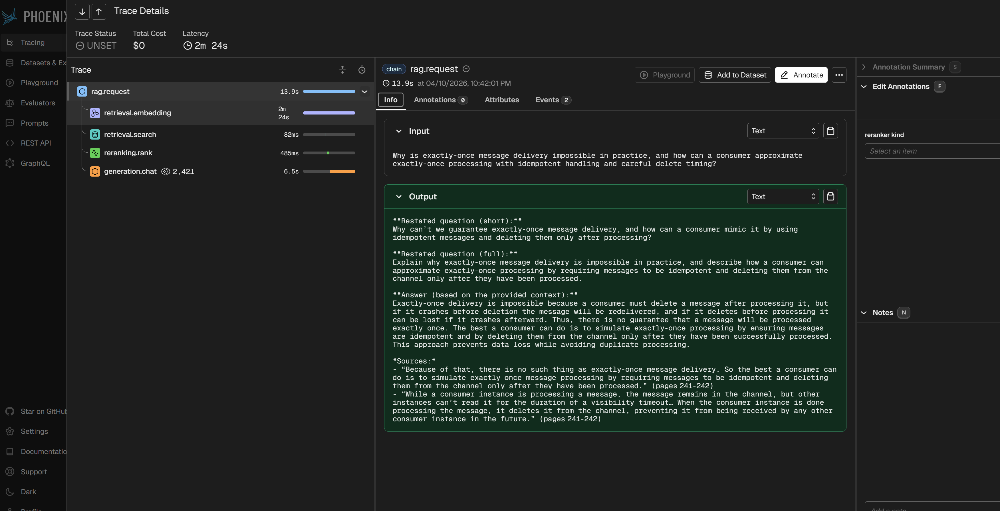

# Observability Story

## What this document covers

This document explains how observability works in the project at runtime.

It focuses on three observability surfaces:

- the OTEL trace emitted by `rag_runtime`
- the metric set emitted through OTLP
- the Phoenix-facing OpenInference slice embedded inside the same trace

It builds on `ARCHITECTURE_OVERVIEW.md` and explains how telemetry is structured, what it records, and how it supports diagnosis across request handling, retrieval quality, reranking behavior, and generation.

---

## Why observability is a first-class workflow in this project

The project does not treat observability as incidental logging around a black-box pipeline.

Instead, observability is specified through separate contracts for:

- **generic OTEL spans**
- **Phoenix/OpenInference semantic spans**
- **metrics**
- **Grafana dashboard artifacts**

This matters because the project wants telemetry to be structurally stable: the same request path should produce a predictable trace shape, a predictable metric set, and a predictable dashboard surface.

That reduces drift between:

- what the runtime emits
- what dashboards expect
- and what engineers look at during diagnosis

---

## The runtime trace model

Each request emits exactly one root span:

- `rag.request`

That root span is created at the beginning of orchestration, is the ancestor of all other spans in the request trace, and closes only after final success or terminal failure.

The mandatory stage hierarchy under the root is:

- `input_validation`
  - `input_validation.normalize`
  - `input_validation.token_count`
- `retrieval`
  - `retrieval.embedding`
  - `retrieval.vector_search`
  - `retrieval.payload_mapping`
- `reranking`
  - `reranking.rank`
- `generation`
  - `generation.prompt_assembly`
  - `generation.chat`
  - `generation.response_validation`

Span ownership is fixed by module: each module creates only its own spans, and cross-module telemetry side effects are forbidden. All mandatory spans carry `span.module`, `span.stage`, and `status`, and error-ending spans also carry `error.type` and `error.message`.

---

## What the trace is meant to show

The trace is designed to answer questions such as:

- where time was spent inside one request
- whether failure happened in validation, retrieval, reranking, or generation
- what retrieval-stage and reranking-stage metric summaries were available for that request
- how many chunks reached generation
- how many tokens were used to assemble the prompt and validate the response
- whether dependency calls succeeded, failed, or retried

In other words, the trace is not only for latency inspection. It is also a compact request-level diagnostic surface for retrieval and generation behavior.

---

## Key span contracts

The span contract in the specification is very detailed. This document keeps only the architectural highlights.

### `rag.request`

`rag.request` is the run-level trace root for one user request.

It always contains:

- `request_id`
- `span.module = orchestration`
- `span.stage = request`
- `status`

It may also carry request-level retrieval summary attributes when the metric bundles are available, including:

- retrieval context loss
- first relevant rank at retrieval stage and context stage
- number of relevant chunks in retrieval top-k and final context top-k

It is also the only place where `request_id` appears as a required high-cardinality trace attribute in the current contract.

### `input_validation.normalize`

This span covers query normalization.

Its main success event is:

- `query_normalized`

with payload such as:

- `trim_whitespace`
- `collapse_internal_whitespace`
- `normalized_query_length`

Its failure event is:

- `query_normalization_failed`

with:

- `error.type`
- `error.message`

### `input_validation.token_count`

This span covers tokenizer invocation and normalized-query token counting.

It carries:

- `input_token_count`

and its failure event is:

- `query_token_count_failed`

with payload such as:

- `tokenizer_source`
- `max_query_tokens`
- `error.type`
- `error.message`

### `retrieval.embedding`

This span covers query embedding generation.

Its success event is:

- `embedding_returned`

with payload such as:

- `embedding_model_name`
- `embedding_length`
- `retry_attempt_count`

Its failure event is:

- `embedding_failed`

with payload such as:

- `embedding_model_name`
- `retry_attempt_count`
- `expected_dimension`
- `actual_dimension`
- `error.type`
- `error.message`

### `retrieval.vector_search`

This span covers the Qdrant search call and response handling.

It always carries:

- `top_k`

and, when golden targets are available, it also carries retrieval metrics such as:

- `recall_soft`
- `recall_strict`
- `rr_soft`
- `rr_strict`
- `ndcg`
- `first_relevant_rank_soft`
- `first_relevant_rank_strict`
- `num_relevant_soft`
- `num_relevant_strict`

### `retrieval.payload_mapping`

This span covers payload validation and payload-to-domain mapping.

Its success event is:

- `payloads_mapped`

with:

- `mapped_chunks`

Its failure event is:

- `payload_mapping_failed`

with:

- `mapped_chunks_before_failure`
- `error.type`
- `error.message`

### `reranking.rank`

This span covers candidate scoring, normalization, deterministic tie-break application, and final selected-order materialization.

It always carries:

- `reranker_kind`
- `final_k`

and, when golden targets are available, it also carries reranking-stage metric summaries such as:

- `recall_soft`
- `recall_strict`
- `rr_soft`
- `rr_strict`
- `ndcg`
- `first_relevant_rank_soft`
- `first_relevant_rank_strict`

Its success/failure event pair includes final reorder completion vs reorder failure.

### `generation.prompt_assembly`

This span covers prompt template rendering and chunk insertion into prompt context.

Its success event is:

- `prompt_assembled`

with payload such as:

- `model_name`
- `tokenizer_source`
- `max_context_chunks`
- `max_prompt_tokens`
- `input_chunks`
- `prompt_length`
- `prompt_token_count`

Its failure event is:

- `prompt_assembly_failed`

with the same configuration context plus:

- `error.type`
- `error.message`

### `generation.chat`

This span covers the generation provider request and response handling.

Its success event is:

- `generation_response_returned`

with payload such as:

- `model_name`
- `temperature`
- `http_status_code`
- `response_content_length`

Its failure event is:

- `generation_request_failed`

with:

- `model_name`
- `temperature`
- `http_status_code`
- `error.type`
- `error.message`

### `generation.response_validation`

This span covers response-shape validation, answer extraction validation, and completion token counting.

Its success event is:

- `generation_response_validated`

and it records response-validation outcomes such as whether an answer is present and the validated token counts. Its failure path records the corresponding validation error details.

---

## Metric set

The metric contract defines a fixed required set emitted through OTLP. Implicit metric creation is forbidden. The current required set is:

- `rag_requests_total`
- `rag_requests_failed_total`
- `rag_request_duration_ms`
- `rag_stage_duration_ms`
- `rag_dependency_duration_ms`
- `rag_retrieval_empty_total`
- `rag_query_token_count`
- `rag_retrieved_chunks_count`
- `rag_generation_input_chunks_count`
- `rag_generation_prompt_tokens`
- `rag_generation_completion_tokens`
- `rag_generation_total_tokens`
- `rag_dependency_failures_total`
- `rag_retry_attempts_total`

The label system is also fixed. The main allowed label values are:

- `stage`: `request`, `input_validation`, `retrieval`, `reranking`, `generation`
- `status`: `ok`, `error`
- `dependency`: `embedding`, `vector_search`, `chat`
- `retriever_kind`: `dense`, `hybrid`

### What these metrics are for

A useful way to read the metric set is by category.

#### Request and stage health
- `rag_requests_total`
- `rag_requests_failed_total`
- `rag_request_duration_ms`
- `rag_stage_duration_ms`

These provide run-rate, failure-rate, and latency surfaces for whole requests and major stages.

#### Dependency health
- `rag_dependency_duration_ms`
- `rag_dependency_failures_total`
- `rag_retry_attempts_total`

These make provider and infrastructure dependencies visible as first-class latency/failure surfaces rather than hiding them inside the parent stage duration.

#### Retrieval and prompt-shape surfaces
- `rag_retrieval_empty_total`
- `rag_retrieved_chunks_count`
- `rag_generation_input_chunks_count`

These help explain whether the request died because retrieval returned nothing, whether the retrieval set was unexpectedly small, and how much context actually reached generation.

#### Token surfaces
- `rag_query_token_count`
- `rag_generation_prompt_tokens`
- `rag_generation_completion_tokens`
- `rag_generation_total_tokens`

These capture the token footprint of the request from normalized query through final validated generation output.

---

## OpenInference / Phoenix slice

The project maintains a dedicated OpenInference semantic slice for Phoenix, but it does **not** create a second trace.

Instead, OpenInference spans exist inside the single OTEL trace emitted by `rag_runtime`, and semantic classification is applied only to a fixed subset of spans:

- `rag.request`
- `retrieval.embedding`
- `retrieval.search`
- `reranking.rank`
- `generation.chat`

The semantic kind mapping is fixed:

- `rag.request` → `CHAIN`
- `retrieval.embedding` → `EMBEDDING`
- `retrieval.search` → `RETRIEVER`
- `reranking.rank` → `RERANKER`
- `generation.chat` → `LLM`

This gives the project two simultaneous views of the same request trace:

- a full OTEL engineering trace for stage-level debugging
- a Phoenix/OpenInference semantic view for chain / retriever / reranker / LLM inspection

That separation is useful because Phoenix wants compact semantic spans, while the engineering trace needs richer operational detail.

---

## What the OpenInference slice carries

### `rag.request` as Phoenix chain span

On the Phoenix side, `rag.request` carries chain-level semantic attributes such as:

- `openinference.span.kind = "CHAIN"`
- `input.value` = normalized query
- `output.value` = final validated assistant answer
- `request.id`
- `app.version`
- `rag.pipeline.name`
- `rag.pipeline.version`
- `prompt_template.id`
- `prompt_template.version`
- `corpus.version`
- token-length curves for retrieval-rank and reranking-rank prefixes

It may also carry compact retrieval-summary attributes such as retrieval context loss and first relevant rank summaries.

### `retrieval.embedding`

The OpenInference embedding span carries:

- `openinference.span.kind = "EMBEDDING"`
- normalized query as `input.value`
- `embedding.model_name`
- `embedding.model_provider = "ollama"`
- `embedding.input.count = 1`
- `embedding.input_role = "query"`
- `embedding.vector_dim`

Its semantic events include `embedding_metadata` and `embedding_returned`. Raw embedding vectors are explicitly forbidden from semantic payload.

### `retrieval.search`

The OpenInference retriever span carries compact retrieval metadata such as:

- `retriever_system = "qdrant"`
- `retriever_strategy`
- `retriever_collection_name`
- `retriever_top_k_requested`
- `retriever_top_k_returned`
- `retriever_score_threshold`
- `retriever_empty`
- `corpus.version`

For hybrid retrieval it may also carry:

- `retriever_dense_vector_name`
- `retriever_sparse_vector_name`
- `retriever_fusion = "rrf"`
- `retriever_sparse_strategy_kind`
- `retriever_sparse_strategy_version`

### `reranking.rank`

The OpenInference reranker span classifies the reranking stage semantically and exposes compact reranker-facing metadata to Phoenix. It exists so reranking can be inspected as an explicit model stage, not as a hidden internal transform.

### `generation.chat`

The OpenInference LLM span carries:

- `openinference.span.kind = "LLM"`
- final validated assistant answer as `output.value`

and gives Phoenix an LLM-facing view of the same generation step that the OTEL trace records operationally. The contract explicitly requires `output.value` on `generation.chat` to match `output.value` on `rag.request`.

---

## Safety and compactness rules for Phoenix-visible payload

The OpenInference contract deliberately keeps semantic payload compact.

Rules include:

- semantic attributes must be deterministic and compact
- raw prompt text must not be duplicated as semantic payload
- raw retrieved document text must not be duplicated as semantic payload
- secrets, API keys, authorization headers, and environment variable values must not appear
- `input.value` and `output.value` are attached only where explicitly allowed

This matters because Phoenix is meant to show a useful semantic slice of the request, not to become a raw dump of everything that passed through the runtime.

---

## How metrics, traces, and dashboards fit together

The observability model has three complementary surfaces.

### Traces
Use traces when the question is:

- where did this request fail
- which stage took the time
- what happened inside retrieval, reranking, or generation
- what request-level retrieval summary attributes were available

### Metrics
Use metrics when the question is:

- how often failures happen
- whether latency is drifting
- whether dependency calls are failing or retrying
- whether prompt/token shapes are changing over time

### Phoenix/OpenInference
Use Phoenix when the question is:

- what the request looked like as a chain / retriever / reranker / LLM flow
- how retrieval and generation compare semantically
- how to inspect a compact semantic view without reading the full engineering trace

Together, these three surfaces let the same request be studied at three different resolutions.

---

## Why the observability contracts are separated

The repository keeps spans, OpenInference spans, and metrics in separate specifications for a reason.

They solve different problems:

- the OTEL span contract defines engineering trace structure and stage ownership
- the metric contract defines stable numeric surfaces and record points
- the OpenInference contract defines the Phoenix-facing semantic subset

Keeping them separate makes it easier to generate telemetry code and dashboard artifacts from explicit contracts, while reducing the risk that runtime emission and visualization drift apart.

---

## Telemetry transport path

Runtime telemetry is not sent directly from the application to each observability backend.

Instead, the application exports traces and metrics to an OpenTelemetry Collector, which acts as the intermediate transport and routing layer between the app and the downstream observability backends.

This matters because it keeps telemetry export decoupled from individual backends and makes it possible to route the same runtime signals into multiple observability surfaces, including Grafana-facing backends and the Phoenix/OpenInference view.

---

## Screenshots

---

## How this document relates to the rest of the docs

- `ARCHITECTURE_OVERVIEW.md` explains where observability sits in the runtime and why it is contract-driven.
- `EVALUATION_STORY.md` explains how eval runs and dashboard-ready eval tables are produced.
- `SPECIFICATION_FIRST_APPROACH.md` explains why observability artifacts are defined through explicit specs instead of growing only from implementation code.

This document focuses specifically on runtime telemetry and its diagnostic surfaces.

---

## Summary

In this project, observability is not treated as generic logging around a RAG pipeline.

It is a contract-driven telemetry system with:

- a fixed OTEL span tree
- a fixed runtime metric set
- a Phoenix/OpenInference semantic slice embedded inside the same trace
- generated dashboard-facing artifacts built from the same observability contracts

That structure makes request behavior easier to inspect, compare, and diagnose without collapsing stage-level engineering telemetry and higher-level semantic inspection into the same surface.
